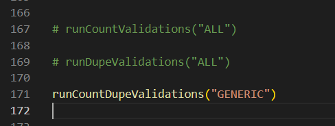

# validateNzvsSf.py

We can use this python script to do automated count validation between Netezza and Snowflake.

## Steps to setup the environment

Run the following command in cmd
```bash 
pip install -r requirements.txt
```
Edit the config.json file and add your own credentials

Run the validateNzvsSf.py to see the results in countValResults.csv
```bash 
python validateNzvsSf.py
```

We can toggle between functions in validateNzvsSf.py to perform the desired set of validations i.e. 

1. To only validate  counts enable runCountValidations("ALL") (faster)
2. To check duplicated enable runDupeValidations("HUB") (runs group by query on snowflake hence might take longer)
3. RunCountDupeValidations("GENERIC") (peforms complete validation i.e. counts + dupe, takes longer to finish)

We can also pass HUB/GENERIC/FCT/ALL as a parameter to these functions(to perform validation on a subset of tables)

meta.csv can be modified and we can add more tables/ filter conditions e.t.c
